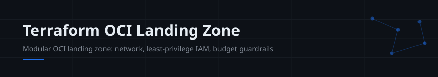
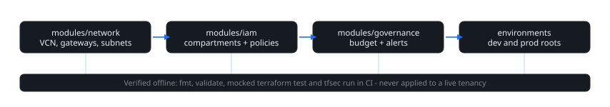

> **Portfolio project** - modular, testable Terraform for an Oracle Cloud landing zone. Validated with `fmt`, `validate`, mocked `terraform test` and `tfsec` in CI. **Never applied to a live tenancy**: no OCI resources exist and nothing here spends money. Running `plan`/`apply` requires your own tenancy and credentials.

[](https://github.com/rajatkumarpradhan/terraform-oci-landing-zone/actions/workflows/ci.yml)

**Start here:** [Architecture](docs/architecture.md) · `environments/dev` · `environments/prod`

A landing zone is the opinionated baseline every workload inherits: network
topology, compartment/IAM structure and cost guardrails, written once and
reused per environment. This repo implements one the way it would be built
for real:

| Module | Creates |
| --- | --- |
| [`modules/network`](modules/network) | VCN, internet/NAT/service gateways, route tables, security lists, per-role subnets |
| [`modules/iam`](modules/iam) | Compartments per concern, admin groups with **compartment-scoped least-privilege policies**, instance dynamic group |
| [`modules/governance`](modules/governance) | Monthly budget with forecast **and** actual-spend alert rules |

Design decisions (private-by-default subnets, no SSH ingress without an
explicit allow-list, one VCN per environment) are documented in
[docs/architecture.md](docs/architecture.md) with a diagram.

## Architecture at a glance



## Layout

```
modules/        reusable building blocks (network, iam, governance)
environments/
  dev/          root module: 3 compartments, public + app subnets, 100-unit budget
  prod/         root module: 4 compartments, public + app + db subnets, 1000-unit budget
  */tests/      terraform test suites running against a mocked OCI provider
```

## Verify without an OCI account

Terraform 1.9+:

```bash
cd environments/dev
terraform init -backend=false
terraform fmt -check -recursive ../..
terraform validate
terraform test        # mocked provider: plans and assertions, zero credentials
```

CI runs the same checks plus `tfsec` on every push.

## Use with a real tenancy (not done here)

```bash
cp environments/dev/terraform.tfvars.example environments/dev/terraform.tfvars
# fill tenancy_ocid, compartment_id, alert_email
cd environments/dev && terraform init && terraform plan
```

Authentication follows the standard OCI provider chain (config file, instance
principal, or environment variables). Nothing in this repository creates,
reads or stores credentials.

## Honest limits

- Plans were never executed against a tenancy; resource arguments follow the
  OCI provider schema but live drift, quotas and service limits are untested.
- Security lists are intentionally simple; production hardening (NSGs per
  workload, flow logs, Vault-backed secrets, OS Hub) is roadmap work.
