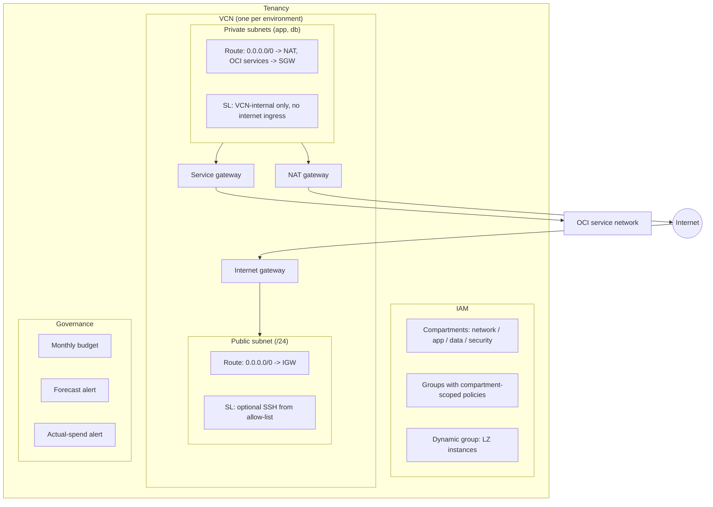

# Architecture

## Design decisions

- **Compartment per concern.** Network, application, data and security
  resources live in separate compartments so policies can grant least
  privilege per team instead of tenancy-wide rights.
- **One VCN per environment.** Dev and prod are separate Terraform root
  modules with separate CIDR ranges; they can be applied independently.
- **Private by default.** Only the public subnet can receive public IPs
  (`prohibit_public_ip_on_vnic` is enforced per subnet). Private subnets
  reach the internet outbound through NAT and OCI services through the
  service gateway; their security list has no internet ingress.
- **No SSH ingress by default.** `allowed_ssh_cidrs` is empty until an
  operator opts in with an explicit allow-list.
- **Spend guardrails.** Every environment gets a monthly budget with both
  forecast and actual-spend alerts; a landing zone that silently burns
  money is not a landing zone.

## Module map

| Module | Creates |
| --- | --- |
| `modules/network` | VCN, IGW, NAT, service gateway, route tables, security lists, subnets |
| `modules/iam` | Compartments, groups, compartment-scoped policies, instance dynamic group |
| `modules/governance` | Monthly budget, forecast and actual alert rules |
